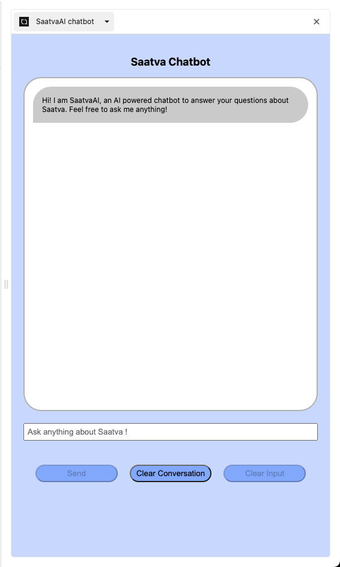

# Instalily Saatva Chatbot manual guide

## Overview

This is a manual to guide you through using the `Saatva Chatbot` chrome extension locally on your computer. 

The `Saatva Chatbot` extension is built on top of the `Chrome Side Panel`, and leverages LLM model `text-davinci-003` as the chat service, focused on answering your questions and concerns about an e-commerce website [Saatva.com](https://www.saatva.com/).

## Setup

Before using the extension, there are a few things we would need to do to set up.

1. Install `python3` and `pip3`

2. Clone the project to a local directory

3. Go to the `/crawler` directory and run the command `pip3 install -r requirements.txt`. This will install all dependendcies needed to run the crawler in order to generate embeddings crawled from Saatva.com.

4. Go to the `/server` directory and run the command `pip3 install -r requirements.txt`. This will install all dependendcies needed to run the server locally, since we will need to start the server to handle requests sent from the frontend extension.

5. Open the `key.ini` file, you will see there is an api_key needed. This is necessary for the service to work because it is required by OpenAI to have an api key to send requests to their LLM models.

6. We are using the model `text-davinci-003` for generating the respond, and since this is not a free model, you will need to create a paid account.

   - Go to [billing](https://platform.openai.com/account/billing/overview) and add a credit/debit card to your account. This will create a pay as you go plan, so you will only be charged depending on how many requests you are sending to OpenAI.

   - Create an api key. Remember to save it, as you will not be able to see it again.

   - Copy and paste your api key to `key.ini`.

7. Go to the `/crawler` directory and run the command `python3 crawl.py`. This will generate the embedded needed for subsequent input for `text-davinci-003` model.

   - Check if there is a `text/www.saatva.com` folder created. It should be if the script is successfully executed.

8. Now go to the `/server` and start up the server with command `flask --app app run`.

   - Make sure the server is successfully started and running on your local machine at `127.0.0.1:5000`.

9. Open up your chrome browser and go to `chrome://extensions/`.

10. Toggle the `Developer mode` switch on in the upper right corner of the page.

11. Now we are going to load our extension to our chrome browser.

    - Select the option `Load unpacked`.

    - Select the `extension` folder. This is the folder which containes the source code and configurations of our chrome extension.

    - You would then observe that a new extension named `SaatvaAI chatbot` is loaded.

12. Open up the `SaatvaAI chatbot` extension by clicking the toolbar, you should see the `SaatvaAI chatbot` extension available. You should see the extension in your side panel like this:

    

13. Now that everything is set up, you can start asking questions! Below are some sample questions you might want to try:

```
What kinds of mattresses are available? What are the price ranges?

What kinds of beddings are available? What are the price ranges?

Can you tell me more about the king sized mattresses?
```

For a demo and a more thorough walkthrough of the `SaatvaAI chatbot` extension watch the video [Walkthrough of the SaatvaAI chatbot extension]().

## References

| Description                                                     | Link                                                                                   |
| :-------------------------------------------------------------- | :------------------------------------------------------------------------------------- |
| How to build an AI that can answer questions about your website | https://platform.openai.com/docs/tutorials/web-qa-embeddings                           |
| How do davinci and text-davinci-003 differ?                     | https://help.openai.com/en/articles/6643408-how-do-davinci-and-text-davinci-003-differ |
| chrome.sidePanel                                                | https://developer.chrome.com/docs/extensions/reference/sidePanel/                      |
